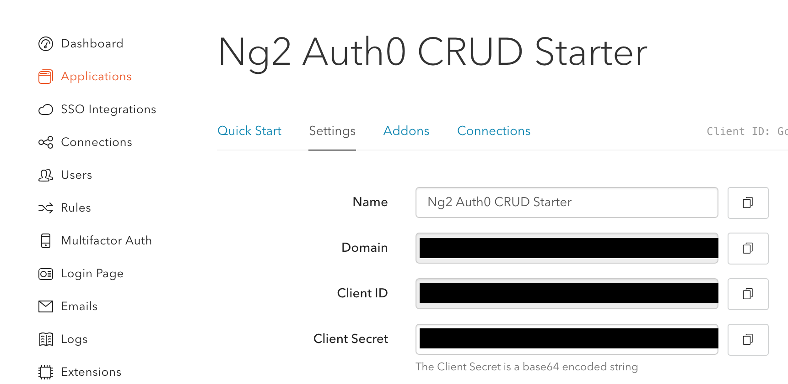

## Angular 2 Auth0 Express MongoDB CRUD Starter

This repo uses Angular 2 Beta 3.

### Getting Started

Go to [Auth0](https://auth0.com/) and create a new application (you'll need to create an account if you don't already have one - it's free)

The information you need can be found under the "Settings" tab after you create a new app - it will look like this:

Add your [Auth0](https://auth0.com/) account information to the following files:

#### Auth0.json

- secret = Client Secret
- audience = Client ID

#### app.ts

- on the "lock = new Auth0Lock" line, add your 'Client ID' and 'Domain'

Install the dependencies:

    $ npm install

Compile the TypeScript into JavaScript and create the bundle:

    $ npm run build

In **_separate_** terminal windows, run the mongo daemon, start the Express server, and start the webpack-dev-server:

    $ mongod
    $ npm run serve
    $ npm start

Navigate to [http://localhost:3000/](http://localhost:3000/)

## License

[WTFPL](LICENSE.md)